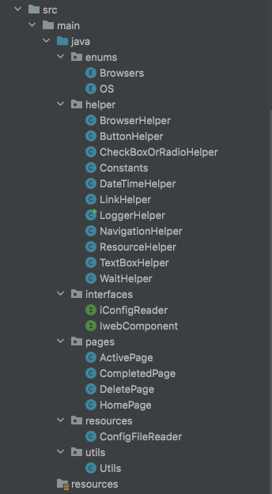
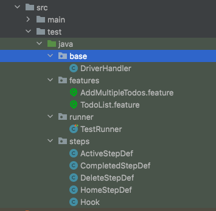
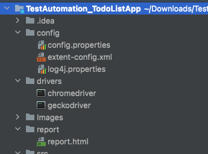
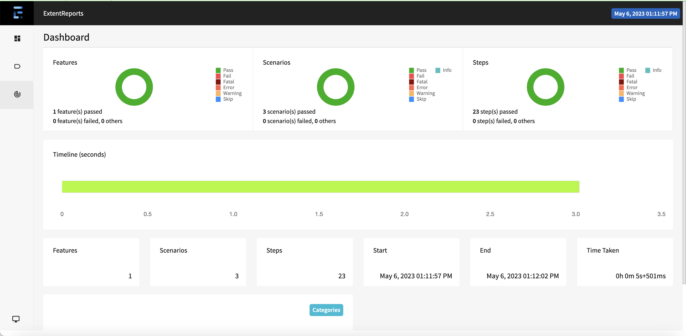
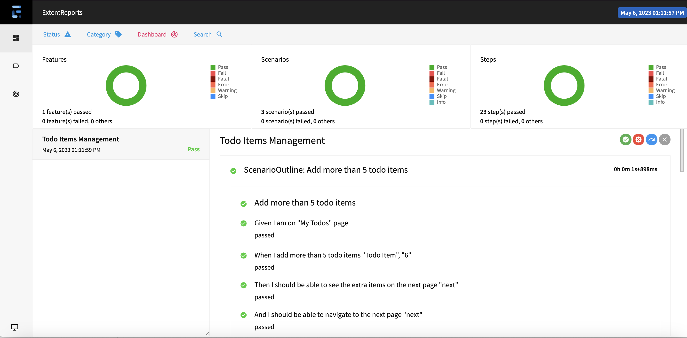

[](http://www.seleniumhq.org/)
# Selenium-Cucumber BDD Automation Framework

The purpose of the project is to display BDD framework for Todo List web application using combination of leading edge tools like Selenium & Cucumber

## Tools & Technologies

* JDK 1.8+ (make sure Java class path is set)
* Automation Tools : Selenium Web Driver & Cucumber
* Project Setup : Apache Maven (make sure .m2 class path is set)
* ItelliJ/Eclipse IDE
* IntelliJ/Eclipse Plugin
    * Maven
    * Cucumber-java
    * Gherkin
* Object Repository Design Pattern : Page Object Model
* Test Execution Report:  Extent Report & TestNG
* CI/CD : Jenkins pipeline with Extent report

### Way to configure Maven (Mac)
<details>
  <summary>Click to view instructions</summary> 

1. Download Maven (tar.gz for mac) from [here](https://maven.apache.org/download.cgi)
2. Move the downloaded apache-maven-3.6.3 folder to your Home directory (This is the folder with your username)

In terminal:

1. Set system variables:
```
export M2_HOME=/Users/<YOUR USER NAME>/apache-maven-3.9.1/
```
2. Append the Maven bin folder to the path:
```
export PATH=$PATH:/Users/<YOUR USER NAME>/apache-maven-3.9.1/bin/
```
3. If you don't have a bash profile, create one:
```
touch .bash_profile
```
4. If you do have one, or after creating one, open the bash profile to edit:
```
open .bash_profile
```
5. Paste the two paths from step 1 and 2
6. Save and close
7. Now Maven will be installed for all sessions. To verify Maven is installed, type:
```
mvn --version
```
</details>

## Project Structure


**src.main.java.enums**:- 
This package has enums.
  It has two class which are as below:

**src.main.java.helper** :- This includes below packages.

**src.main.java.pages** :- It has to do application related pages and pages contains object repository, actions to perform on objects

**src.main.java.resources** :- It has ConfigFileReader.java to read the config.properties file

**src.main.java.utils** :- It will use to perform utility functions.

**src.test.java** : It will to write .feature file, runner class, step definitions, Driver handler and Hook class.

* src.test.features:-
  In this package you can create all the feature files which has step to be followed in Automation Script.

* src.test.steps:-
  StepDefinition file according to feature file. It has methods as steps in feature file, in that we have to write code for implementation.

* src.test.runner:-
  This package has class which run the feature files according to the test cases. In this package we can call the feature files.
  Runner class call the cucumber feature file by adding @CucumberOptions annotation (which is used to configuration for feature file).




drivers :-
This folder contains driver executable files like chromedriver, geckodriver etc.

config :-
This folder contains .properties files

Report:-
ExtentReport has been generated after test execution and extent-config.xml file which contains all configuration.


* screenShot:-
  If test script failed then we capture the screen short and save in this folder

* Pom.xml:-
  It will include all dependencies and download automatically in its repository.

* qa.yaml:-

# How to Setup & Run the project:-
We are using maven build so it has pom.xml files. This file has all the configuration of the project. We can all the libraries in that xml file. Following are the steps to run the project.

## How to run tests
In terminal:
```
git clone https://github.com/kirananarase/TestAutomation_TodoListApp.git
```

* Import project :- First you have to import your project in eclipse/IntelliJ IDE. Select project setup path for build.
* Open IDE > go to file > click on import link
* Project Path :-You have to select proper project path. Project path should be your project location where .setting and pom.xml file where exist. Import existing maven project and click on next button.
* Select the root directory the project is and Click Finish

Change directory to the location of cloned project folder and run docker compose -f qa.yaml up -d and Maven clean
```
docker compose -f qa.yaml up -d
```
```
mvn clean
```
To run the test
```
mvn clean verify
```

* After test execution you will find report in /report/report.html folder

